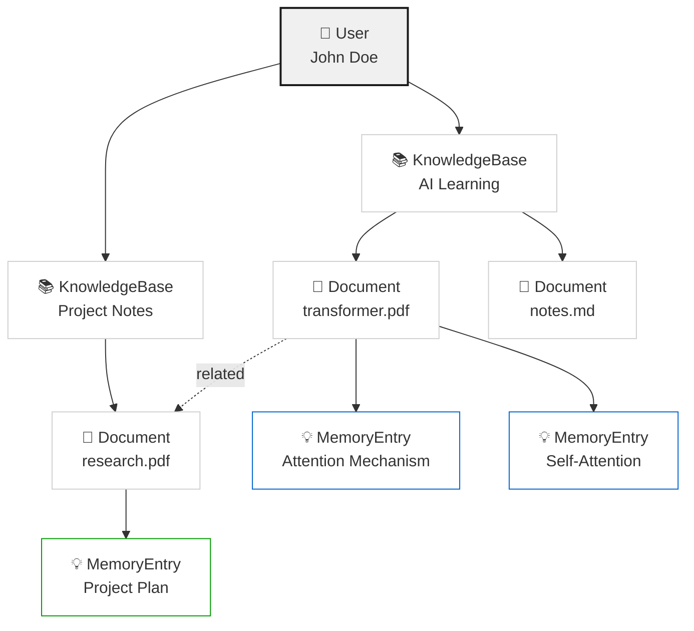
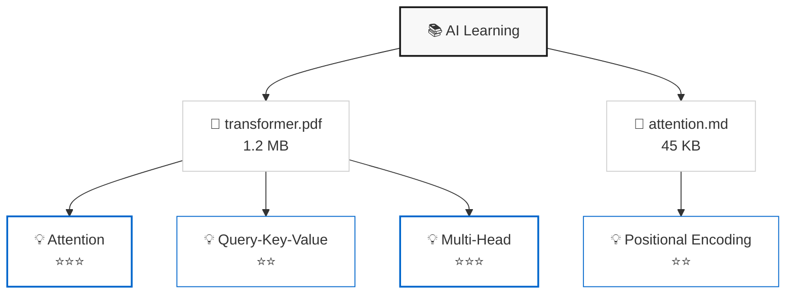

# Karpathy 知识库风格树形结构可视化规范

## 核心设计理念

基于 Mneme 后端的图数据模型，构建一个**三层级树形结构**，支持展开/折叠、语义关联、重要度可视化。

---

## 1. 树形结构层级定义

### 层级关系

```
Level 0: User (用户)
  ├─ Level 1: KnowledgeBase (知识库)
  │   ├─ Level 2: Document (文档)
  │   │   └─ Level 3: MemoryEntry (记忆条目)
  │   └─ [Related Documents] (关联文档)
  └─ [Cross-KB Relationships] (跨库关联)
```

### 节点类型与描述

| 层级 | 节点类型 | 字段 | 描述 | 最大字符 |
|------|---------|------|------|---------|
| 0 | `user` | `display_name` | 用户名 | 8 |
| 1 | `knowledge_base` | `name` | 知识库名 | 10 |
| 2 | `document` | `file_name` | 文档名 | 12 |
| 3 | `memory_entry` | `entry_name` | 记忆条目 | 10 |

### 节点状态

```typescript
type NodeState = 
  | 'default'      // 正常
  | 'expanded'     // 已展开
  | 'collapsed'    // 已折叠
  | 'loading'      // 加载中
  | 'error'        // 错误
  | 'highlighted'  // 高亮（选中/悬停）
```

---

## 2. 数据结构定义

### 前端树节点模型

```typescript
interface TreeNode {
  // 标识
  id: string                    // 后端 entity_id
  nodeType: 'user' | 'knowledge_base' | 'document' | 'memory_entry'
  
  // 显示
  label: string                 // 节点标签（≤10字）
  description?: string          // 简短描述（≤20字）
  icon?: string                 // 图标类型
  
  // 层级
  parentId?: string             // 父节点 ID
  depth: number                 // 深度（0-3）
  
  // 状态
  state: NodeState
  isExpanded: boolean
  hasChildren: boolean
  childrenCount?: number
  
  // 样式
  importance?: number           // 0-1，用于大小/颜色
  entryType?: string            // memory_entry 的类型
  
  // 元数据
  metadata?: {
    fileSize?: number           // 文档大小
    createdAt?: string          // 创建时间
    updatedAt?: string          // 更新时间
    status?: string             // 文档状态
    importance_score?: number   // 记忆条目重要度
    evidence_text?: string      // 证据文本
  }
}

interface TreeEdge {
  id: string
  source: string               // 源节点 ID
  target: string               // 目标节点 ID
  edgeType: 'owns' | 'contains' | 'extracts' | 'related'
  
  metadata?: {
    relationship_score?: number // 关联强度 0-1
    shared_memory_count?: number
    shared_memory_types?: string[]
  }
}

interface TreeData {
  nodes: TreeNode[]
  edges: TreeEdge[]
  rootId: string               // 当前用户 ID
}
```

---

## 3. 后端 API 映射

### 获取完整树数据

```bash
GET /graph?include_memory=true&include_relationships=true
```

**响应映射**：
- 后端 `GraphNodeData` → 前端 `TreeNode`
- 后端 `GraphEdgeData` → 前端 `TreeEdge`

### 获取知识库子树

```bash
GET /graph/knowledge-bases/{knowledge_base_id}?include_memory=true&include_relationships=true
```

**用途**：展开知识库节点时加载

### 获取文档详情与关联

```bash
GET /graph/documents/{document_id}?include_memory=true&include_relationships=true
```

**用途**：展开文档节点时加载相关文档和记忆条目

### 获取记忆库分组视图

```bash
GET /memory/knowledge-bases/{knowledge_base_id}/library
```

**用途**：侧边栏显示按类型/主题分组的记忆条目

---

## 4. 视觉设计规范

### 色彩方案（简约黑白）

```css
/* 背景 */
--bg-primary: #ffffff
--bg-secondary: #f8f8f8
--bg-tertiary: #f0f0f0

/* 文字 */
--text-primary: #1a1a1a
--text-secondary: #666666
--text-tertiary: #999999

/* 节点 */
--node-bg: #ffffff
--node-border: #d0d0d0
--node-border-hover: #808080
--node-border-selected: #1a1a1a

/* 边 */
--edge-stroke: #cccccc
--edge-stroke-hover: #666666
--edge-shadow: rgba(0, 0, 0, 0.08)

/* 状态 */
--state-loading: #0066cc
--state-error: #cc0000
--state-success: #009900
```

### 节点样式

```css
/* 基础节点 */
.tree-node {
  display: flex;
  align-items: center;
  gap: 8px;
  padding: 8px 12px;
  border-radius: 6px;           /* 圆角矩形 */
  border: 1px solid var(--node-border);
  background: var(--node-bg);
  font-size: 13px;
  font-weight: 500;
  color: var(--text-primary);
  cursor: pointer;
  transition: all 0.2s ease;
  box-shadow: 0 1px 2px var(--edge-shadow);
}

/* 悬停状态 */
.tree-node:hover {
  border-color: var(--node-border-hover);
  box-shadow: 0 2px 4px var(--edge-shadow);
}

/* 选中状态 */
.tree-node.selected {
  border-color: var(--node-border-selected);
  background: var(--bg-tertiary);
  font-weight: 600;
}

/* 展开/折叠指示器 */
.tree-node__toggle {
  width: 16px;
  height: 16px;
  display: flex;
  align-items: center;
  justify-content: center;
  font-size: 10px;
  color: var(--text-secondary);
  transition: transform 0.2s ease;
}

.tree-node.expanded .tree-node__toggle {
  transform: rotate(90deg);
}

/* 节点图标 */
.tree-node__icon {
  width: 16px;
  height: 16px;
  flex-shrink: 0;
  display: flex;
  align-items: center;
  justify-content: center;
  font-size: 12px;
}

/* 节点标签 */
.tree-node__label {
  flex: 1;
  white-space: nowrap;
  overflow: hidden;
  text-overflow: ellipsis;
  max-width: 120px;
}

/* 节点元数据 */
.tree-node__meta {
  font-size: 11px;
  color: var(--text-tertiary);
  margin-left: auto;
}
```

### 边线样式

```css
/* SVG 连接线 */
.tree-edge {
  stroke: var(--edge-stroke);
  stroke-width: 1px;
  fill: none;
  filter: drop-shadow(0 1px 2px var(--edge-shadow));
  transition: stroke 0.2s ease;
}

.tree-edge:hover {
  stroke: var(--edge-stroke-hover);
  stroke-width: 1.5px;
}

/* 关联边（虚线） */
.tree-edge.related {
  stroke-dasharray: 4, 4;
  stroke: var(--text-tertiary);
}

.tree-edge.related:hover {
  stroke: var(--edge-stroke-hover);
}
```

### 层级缩进

```css
.tree-level-0 { margin-left: 0px; }
.tree-level-1 { margin-left: 24px; }
.tree-level-2 { margin-left: 48px; }
.tree-level-3 { margin-left: 72px; }
```

### 重要度可视化

```css
/* 记忆条目大小按重要度缩放 */
.tree-node.memory-entry {
  font-size: calc(12px + var(--importance) * 2px);
  padding: calc(6px + var(--importance) * 2px) 
           calc(10px + var(--importance) * 2px);
}

/* 记忆条目颜色按类型 */
.tree-node.memory-entry[data-type="concept"] {
  border-color: #0066cc;
}

.tree-node.memory-entry[data-type="insight"] {
  border-color: #009900;
}

.tree-node.memory-entry[data-type="question"] {
  border-color: #cc6600;
}

.tree-node.memory-entry[data-type="action"] {
  border-color: #cc0066;
}
```

---

## 5. 交互规范

### 展开/折叠

```typescript
// 点击节点的展开按钮
onToggleNode(nodeId: string) {
  const node = findNode(nodeId)
  
  if (node.isExpanded) {
    // 折叠：隐藏子节点
    collapseNode(nodeId)
  } else {
    // 展开：加载子节点
    if (!node.childrenLoaded) {
      loadChildren(nodeId)  // 异步加载
    }
    expandNode(nodeId)
  }
}
```

### 节点选择

```typescript
onSelectNode(nodeId: string) {
  // 更新选中状态
  clearSelection()
  selectNode(nodeId)
  
  // 显示详情面板
  showDetailPanel(nodeId)
  
  // 高亮关联节点
  highlightRelated(nodeId)
}
```

### 悬停提示

```typescript
onHoverNode(nodeId: string) {
  const node = findNode(nodeId)
  
  // 显示 Tooltip
  showTooltip({
    title: node.label,
    description: node.description,
    metadata: node.metadata,
    position: 'right'
  })
  
  // 高亮连接边
  highlightEdges(nodeId)
}
```

### 搜索与过滤

```typescript
onSearch(query: string) {
  // 模糊匹配节点标签
  const matches = nodes.filter(n => 
    n.label.includes(query) || 
    n.description?.includes(query)
  )
  
  // 展开匹配节点的所有祖先
  matches.forEach(node => {
    expandAncestors(node.id)
  })
  
  // 高亮匹配节点
  highlightNodes(matches.map(n => n.id))
}
```

---

## 6. 前端实现指导

### Vue 3 + TypeScript 组件结构

```
src/components/knowledge-tree/
├── KnowledgeTree.vue           # 主容器
├── TreeNode.vue                # 单个节点
├── TreeEdge.vue                # 连接线（SVG）
├── TreePanel.vue               # 侧边栏详情
├── TreeSearch.vue              # 搜索栏
└── composables/
    ├── useTreeData.ts          # 数据管理
    ├── useTreeInteraction.ts   # 交互逻辑
    └── useTreeLayout.ts        # 布局计算
```

### 核心 Composable

```typescript
// useTreeData.ts
export function useTreeData() {
  const nodes = ref<TreeNode[]>([])
  const edges = ref<TreeEdge[]>([])
  const selectedNodeId = ref<string | null>(null)
  
  // 从后端加载树数据
  async function loadTree(userId: string) {
    const response = await api.get(`/graph?include_memory=true`)
    nodes.value = response.nodes
    edges.value = response.edges
  }
  
  // 展开节点并加载子节点
  async function expandNode(nodeId: string) {
    const node = nodes.value.find(n => n.id === nodeId)
    if (!node) return
    
    node.state = 'loading'
    
    try {
      let childResponse
      
      if (node.nodeType === 'knowledge_base') {
        childResponse = await api.get(
          `/graph/knowledge-bases/${nodeId}?include_memory=true`
        )
      } else if (node.nodeType === 'document') {
        childResponse = await api.get(
          `/graph/documents/${nodeId}?include_memory=true`
        )
      }
      
      if (childResponse) {
        // 合并新节点和边
        nodes.value.push(...childResponse.nodes)
        edges.value.push(...childResponse.edges)
      }
      
      node.isExpanded = true
      node.state = 'default'
    } catch (error) {
      node.state = 'error'
    }
  }
  
  return {
    nodes,
    edges,
    selectedNodeId,
    loadTree,
    expandNode
  }
}
```

### Mermaid 图表导出

```typescript
// 将树数据转换为 Mermaid 语法
function exportToMermaid(treeData: TreeData): string {
  let mermaid = 'graph TD\n'
  
  treeData.nodes.forEach(node => {
    const label = `${node.label}<br/><small>${node.nodeType}</small>`
    mermaid += `  ${node.id}["${label}"]\n`
  })
  
  treeData.edges.forEach(edge => {
    const style = edge.edgeType === 'related' ? '-.->|related|' : '-->'
    mermaid += `  ${edge.source} ${style} ${edge.target}\n`
  })
  
  return mermaid
}
```

---

## 7. Mermaid 树形结构示例

### 完整树示例



### 知识库子树示例



---

## 8. 提示词模板

### 用于 LLM 生成树形结构描述

```
你是一个知识库可视化专家。基于以下用户的知识库数据，生成一个 Karpathy 风格的树形结构描述。

用户知识库：
- 知识库名称：{kb_name}
- 文档数量：{doc_count}
- 记忆条目数：{memory_count}

文档列表：
{documents_json}

记忆条目列表（按重要度排序）：
{memory_entries_json}

请生成：
1. 树形结构的文字描述（3-5 层级）
2. 核心概念的总结（≤50字）
3. 关键关联关系（3-5 条）
4. 建议的可视化重点（2-3 个）

格式要求：
- 使用 Markdown 列表
- 每个节点描述 ≤10 字
- 标注重要度（⭐ 1-5）
- 标注节点类型（📚/📄/💡）
```

### 用于生成记忆条目摘要

```
基于以下文档内容，提取 3-5 个核心记忆条目。

文档：{document_name}
内容摘录：{content_excerpt}

对于每个记忆条目，提供：
- 条目名称（≤10字）
- 条目类型（concept/insight/question/action）
- 摘要（≤30字）
- 重要度评分（0-1）
- 证据文本（原文引用）

输出格式为 JSON 数组。
```

---

## 9. 集成检查清单

- [ ] 后端 `/graph` API 已实现并返回 `GraphNodeData` 和 `GraphEdgeData`
- [ ] 前端 `TreeNode` 和 `TreeEdge` 类型已定义
- [ ] Vue 组件 `KnowledgeTree.vue` 已创建
- [ ] 样式文件已应用（圆角矩形、阴影、黑白配色）
- [ ] 展开/折叠交互已实现
- [ ] 节点选择与详情面板已实现
- [ ] 搜索与过滤功能已实现
- [ ] 记忆条目按重要度可视化已实现
- [ ] 关联文档边线已显示
- [ ] Mermaid 导出功能已实现
- [ ] 响应式布局已测试
- [ ] 性能优化（虚拟滚动、懒加载）已应用

---

## 10. 性能优化建议

### 虚拟滚动

```typescript
// 对于大量节点，使用虚拟滚动
import { useVirtualList } from '@vueuse/core'

const { list, containerProps, wrapperProps } = useVirtualList(
  nodes,
  { itemHeight: 40 }
)
```

### 懒加载子节点

```typescript
// 只在展开时加载子节点
async function expandNode(nodeId: string) {
  const node = findNode(nodeId)
  
  if (!node.childrenLoaded) {
    await loadChildren(nodeId)
    node.childrenLoaded = true
  }
  
  node.isExpanded = true
}
```

### 边线渲染优化

```typescript
// 使用 Canvas 而非 SVG 绘制大量边线
const canvas = ref<HTMLCanvasElement>()
const ctx = canvas.value?.getContext('2d')

function drawEdges() {
  edges.value.forEach(edge => {
    const source = findNode(edge.source)
    const target = findNode(edge.target)
    
    ctx?.beginPath()
    ctx?.moveTo(source.x, source.y)
    ctx?.lineTo(target.x, target.y)
    ctx?.stroke()
  })
}
```

---

## 11. 扩展方向

### 时间线视图

```typescript
// 按创建时间展示记忆条目演进
function renderTimeline(memoryEntries: MemoryEntry[]) {
  const grouped = groupBy(memoryEntries, e => 
    new Date(e.createdAt).toLocaleDateString()
  )
  
  return Object.entries(grouped).map(([date, entries]) => ({
    date,
    entries,
    count: entries.length
  }))
}
```

### 主题聚类视图

```typescript
// 按 entry_type 聚类显示
function renderThemeCluster(memoryEntries: MemoryEntry[]) {
  const grouped = groupBy(memoryEntries, e => e.entry_type)
  
  return Object.entries(grouped).map(([type, entries]) => ({
    type,
    entries,
    count: entries.length,
    avgImportance: mean(entries.map(e => e.importance_score))
  }))
}
```

### 关联强度热力图

```typescript
// 显示文档间的关联强度
function renderRelationshipHeatmap(edges: TreeEdge[]) {
  const relatedEdges = edges.filter(e => e.edgeType === 'related')
  
  return relatedEdges.map(edge => ({
    source: edge.source,
    target: edge.target,
    strength: edge.metadata?.relationship_score || 0,
    sharedMemories: edge.metadata?.shared_memory_count || 0
  }))
}
```

---

## 总结

这个规范提供了：

1. **三层级树形结构**：User → KnowledgeBase → Document → MemoryEntry
2. **简约黑白视觉设计**：圆角矩形、轻微阴影、清晰层级感
3. **完整交互规范**：展开/折叠、选择、搜索、悬停提示
4. **后端 API 映射**：直接对接 `/graph` 系列接口
5. **前端实现指导**：Vue 3 组件结构、Composable、Mermaid 导出
6. **性能优化方案**：虚拟滚动、懒加载、Canvas 渲染
7. **扩展方向**：时间线、主题聚类、关联热力图

可直接用于生产环境实现。
