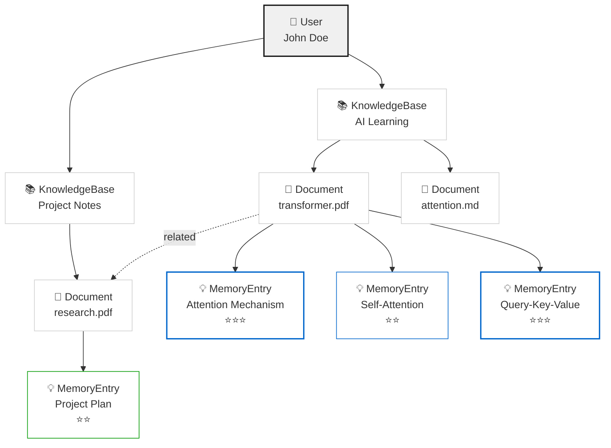
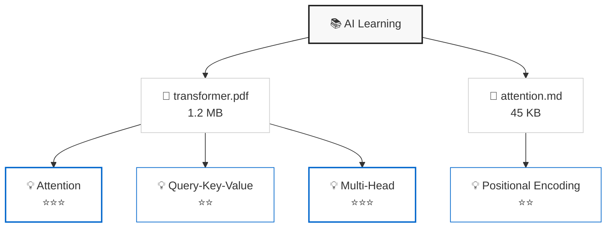
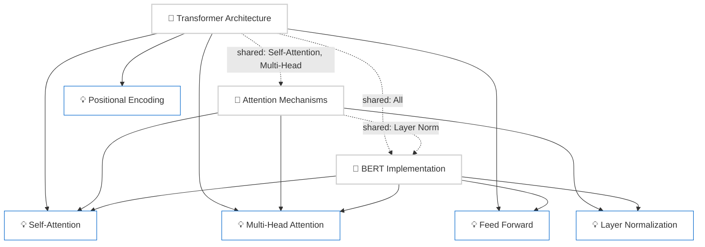
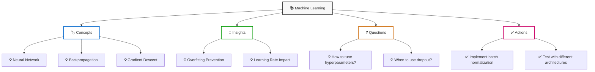
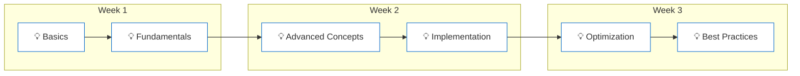
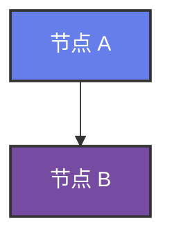
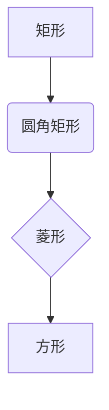
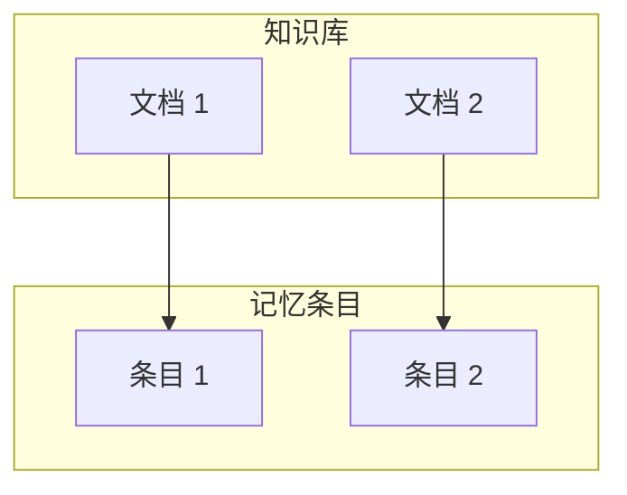

# Karpathy 知识库树形结构 - Mermaid 示例

## 完整树示例



## 知识库子树示例



## 文档关联示例



## 按类型分组示例



## 时间线示例



---

## 如何使用这些示例

### 1. 在 Obsidian 中查看

复制 Mermaid 代码块到 Obsidian 笔记，会自动渲染为图表。

### 2. 在 GitHub 中查看

在 GitHub README 或 Issues 中粘贴 Mermaid 代码块，会自动渲染。

### 3. 在 Mermaid Live Editor 中查看

访问 https://mermaid.live，粘贴代码块查看实时渲染。

### 4. 导出为图片

使用 Mermaid CLI：

```bash
npm install -g @mermaid-js/mermaid-cli
mmdc -i tree.md -o tree.png
```

---

## 自定义样式

### 修改颜色



### 修改形状



### 添加子图



---

## 性能建议

- 对于超过 100 个节点的树，建议分层显示
- 使用虚拟滚动优化大型树的渲染
- 对于关联边线，建议限制显示数量（max_related_edges）
- 使用 Canvas 而非 SVG 绘制大量边线
